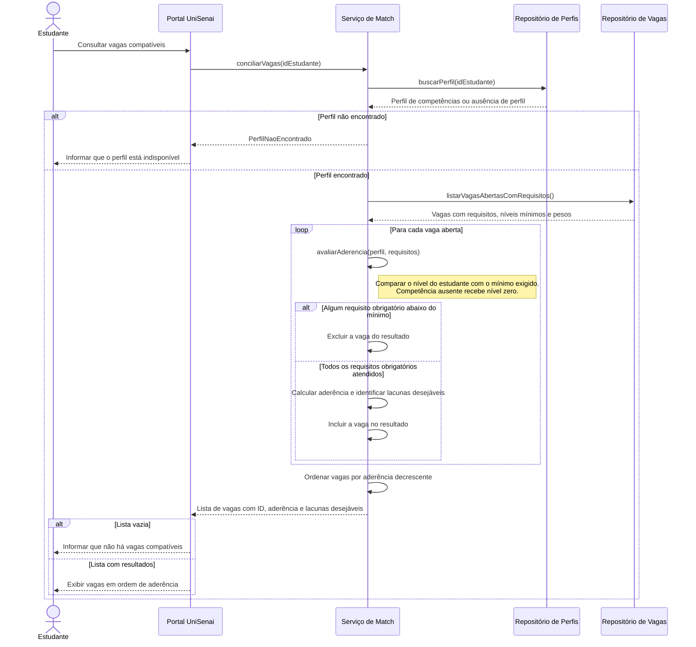

```mermaid
sequenceDiagram
    actor E as Estudante
    participant P as Portal UniSenai
    participant M as Serviço de Match
    participant RP as Repositório de Perfis
    participant RV as Repositório de Vagas

    E->>P: Consultar vagas compatíveis
    P->>M: conciliarVagas(idEstudante)
    M->>RP: buscarPerfil(idEstudante)
    RP-->>M: Perfil de competências ou ausência de perfil

    alt Perfil não encontrado
        M-->>P: PerfilNaoEncontrado
        P-->>E: Informar que o perfil está indisponível
    else Perfil encontrado
        M->>RV: listarVagasAbertasComRequisitos()
        RV-->>M: Vagas com requisitos, níveis mínimos e pesos

        loop Para cada vaga aberta
            M->>M: avaliarAderencia(perfil, requisitos)
            Note right of M: Comparar o nível do estudante com o mínimo exigido.<br/>Competência ausente recebe nível zero.
            alt Algum requisito obrigatório abaixo do mínimo
                M->>M: Excluir a vaga do resultado
            else Todos os requisitos obrigatórios atendidos
                M->>M: Calcular aderência e identificar lacunas desejáveis
                M->>M: Incluir a vaga no resultado
            end
        end

        M->>M: Ordenar vagas por aderência decrescente
        M-->>P: Lista de vagas com ID, aderência e lacunas desejáveis
        alt Lista vazia
            P-->>E: Informar que não há vagas compatíveis
        else Lista com resultados
            P-->>E: Exibir vagas em ordem de aderência
        end
    end
```