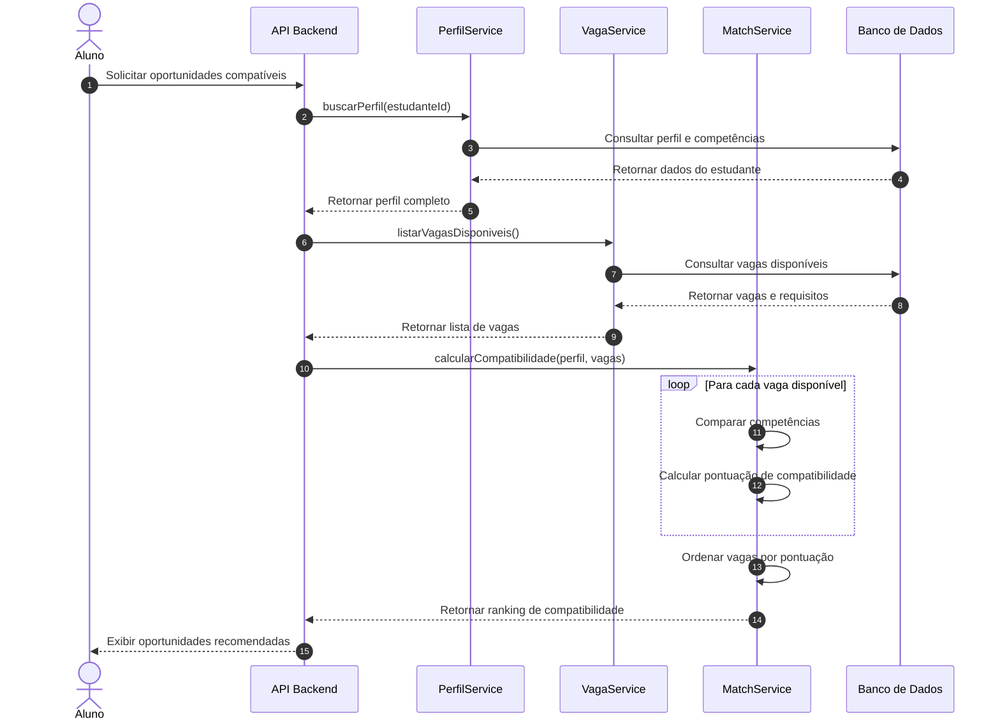

# Diagrama de Sequência — Match de Estágios UniSenai

Este diagrama representa o processo de conciliação entre as
competências do estudante e os requisitos das vagas de estágio.

```mermaid
sequenceDiagram
    autonumber

    actor Aluno
    participant API as API Backend
    participant Perfil as PerfilService
    participant Vaga as VagaService
    participant Match as MatchService
    participant DB as Banco de Dados

    Aluno->>API: Solicitar oportunidades compatíveis

    API->>Perfil: buscarPerfil(estudanteId)
    Perfil->>DB: Consultar perfil e competências
    DB-->>Perfil: Retornar dados do estudante
    Perfil-->>API: Retornar perfil completo

    API->>Vaga: listarVagasDisponiveis()
    Vaga->>DB: Consultar vagas disponíveis
    DB-->>Vaga: Retornar vagas e requisitos
    Vaga-->>API: Retornar lista de vagas

    API->>Match: calcularCompatibilidade(perfil, vagas)

    loop Para cada vaga disponível
        Match->>Match: Comparar competências
        Match->>Match: Calcular pontuação de compatibilidade
    end

    Match->>Match: Ordenar vagas por pontuação
    Match-->>API: Retornar ranking de compatibilidade

    API-->>Aluno: Exibir oportunidades recomendadas
```
